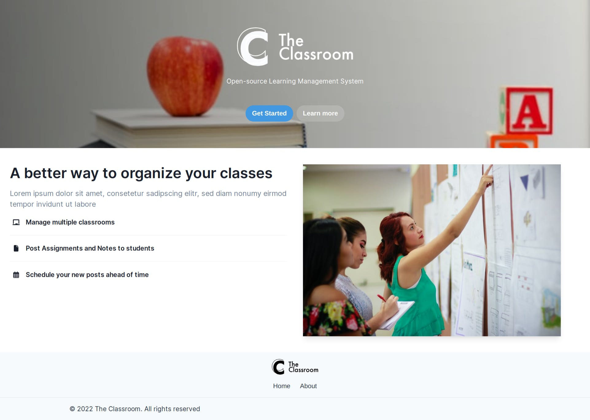
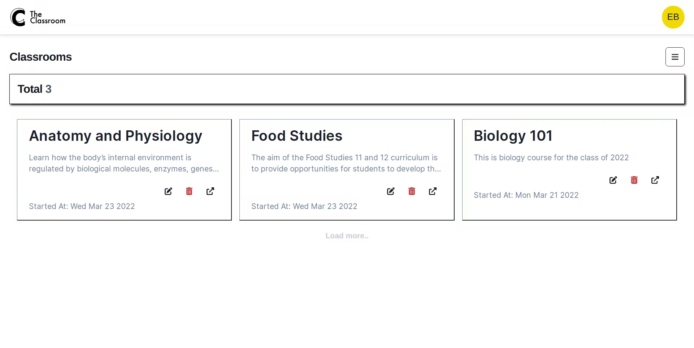
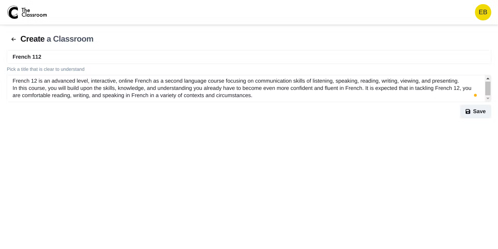
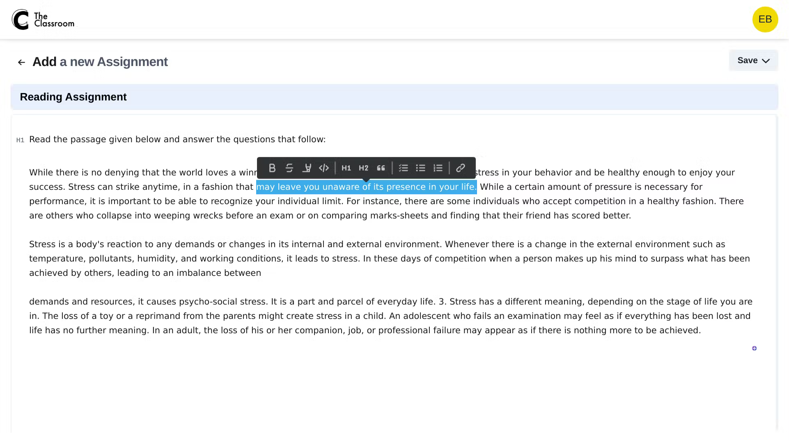
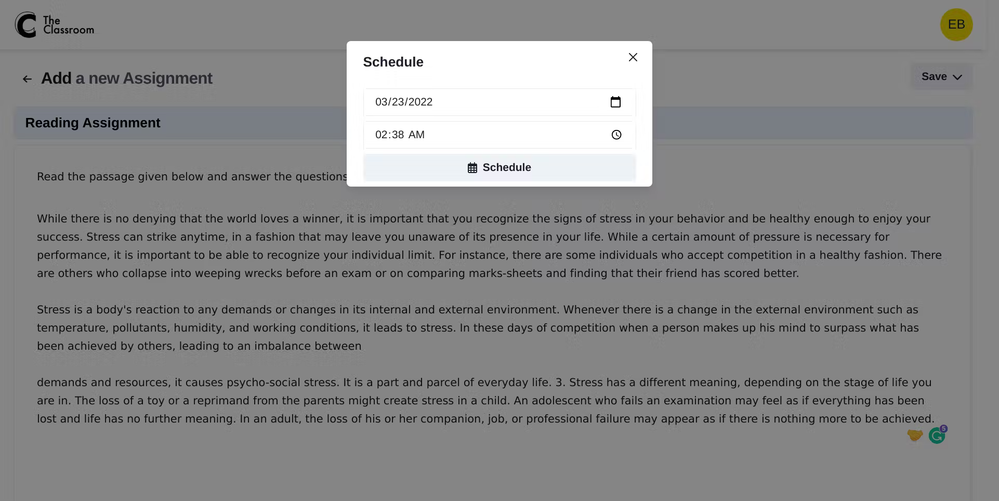

<p align="center">
  <a href="https://github.com/eyuelberga/TheClassroom">
    
  </a>
</p>

<br>

<p align="center">
<a href="https://github.com/eyuelberga/TheClassroom/blob/main/LICENSE"></a>
</p>
<br />

The Classroom is a learning management system, similar to Google Classrooms, where 
Teachers can share school resources with their Students. 

The project was built using React, Auth0, and the Hasura GraphQL Engine.


## Preview










## Setting up Hasura

The Hasura project files are located in the folder `hasura`. You can use the Hasura CLI to start a local instance or deploy it remotely. 

## Setting up Auth0

For Hasura and Auth0 to work properly, you need to set up two actions, which can be found in the `/auth0/actions` folder.

Both actions have two environment variables you need to supply:

```
HASURA_GRAPHQL_HTTPS_URL: absolute URL to the GraphQL API
HASURA_ADMIN_SECRET: admin secret for the API

```

- `post-login-add-jwt-clams` action should be added to the `Login` flow
- `post-registration-sync-with-hasura-db` action should be added to the `Post User Registration` flow

You also need to get the JWT secret from Auth0. use [this link to get the JWT config](https://hasura.io/jwt-config/).

A custom login page with extra fields for full name and account type is also found in the `auth0/custom-login-page.html`

## Setting the APIs for scheduling and email notification

There are two APIs that need to be deployed. These are:
The scheduler API for creating One-off Scheduled events and another endpoint for publishing a class resource. It is located at `apis/scheduler` 
The Email notification API for sending emails to enrolled students when a teacher publishes a new class resource. It is located at `apis/send_email`. You also need a [Mailjet](https://www.mailjet.com/) account for this.

After running the two APIs, you need to link them to Hasura using env vars:
```
SCHEDULE_API_BASE_URL
EMAIL_NOTIFICATION_WEB_HOOK_URL
```

## Setting up the React frontend

The front-end is located at `/web`.  You just need to add the following env vars:

```
REACT_APP_GRAPHQL_HTTPS_URL
REACT_APP_GRAPHQL_WSS_URL
REACT_APP_AUTH0_DOMAIN
REACT_APP_AUTH0_CLIENT_ID
REACT_APP_AUTH0_AUDIENCE
```

## License

MIT © [Eyuel Berga](https://github.com/eyuelberga)
